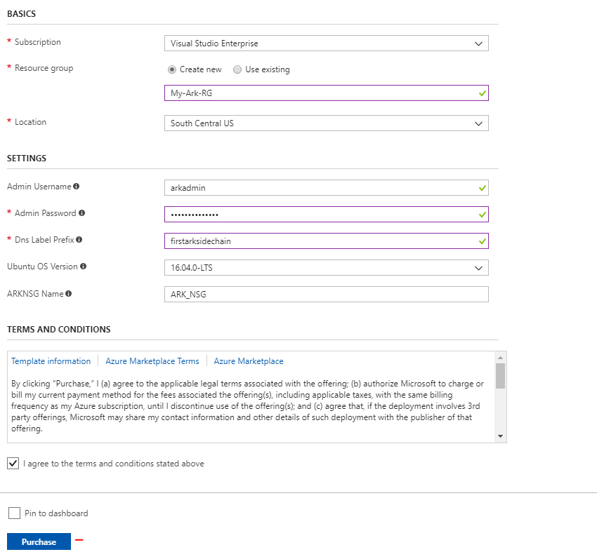
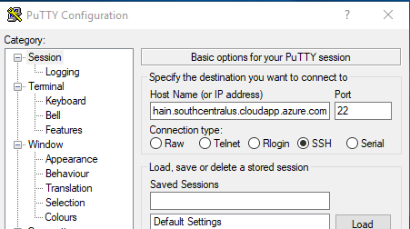
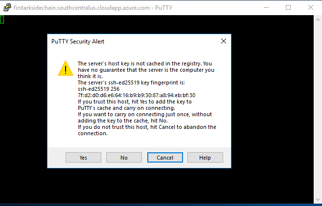
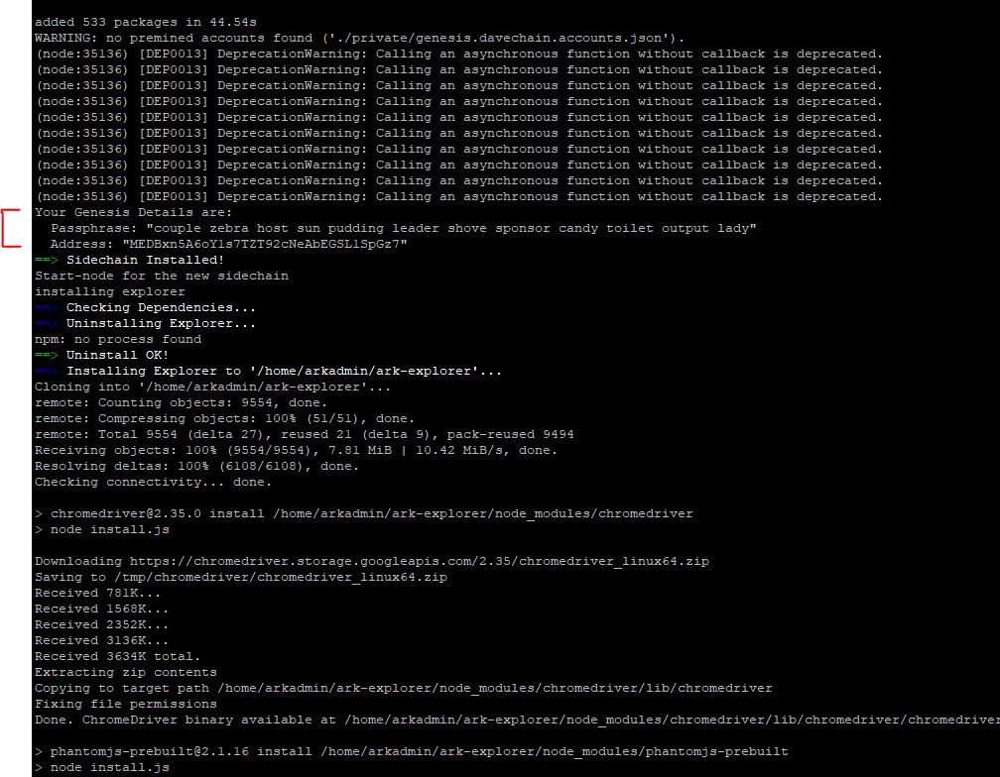
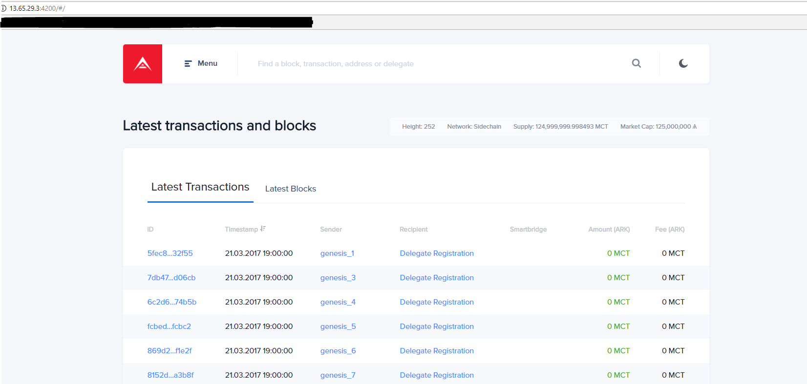
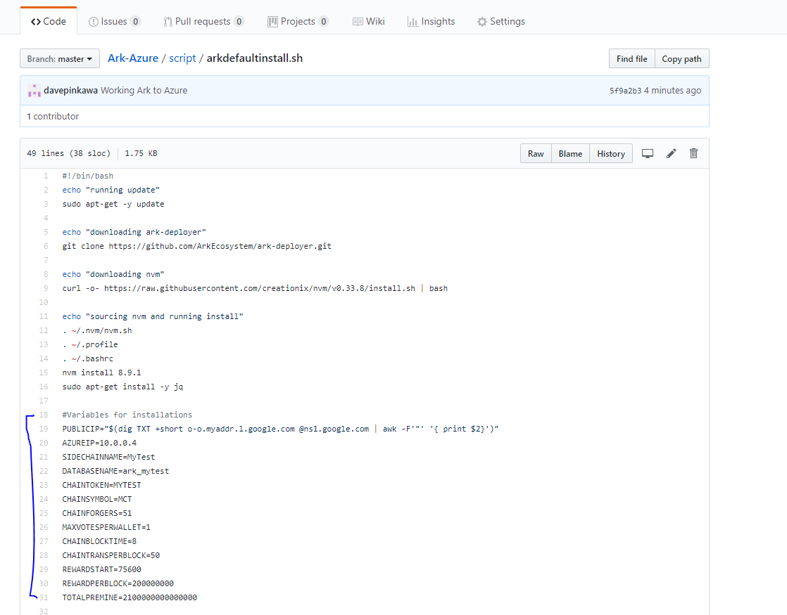
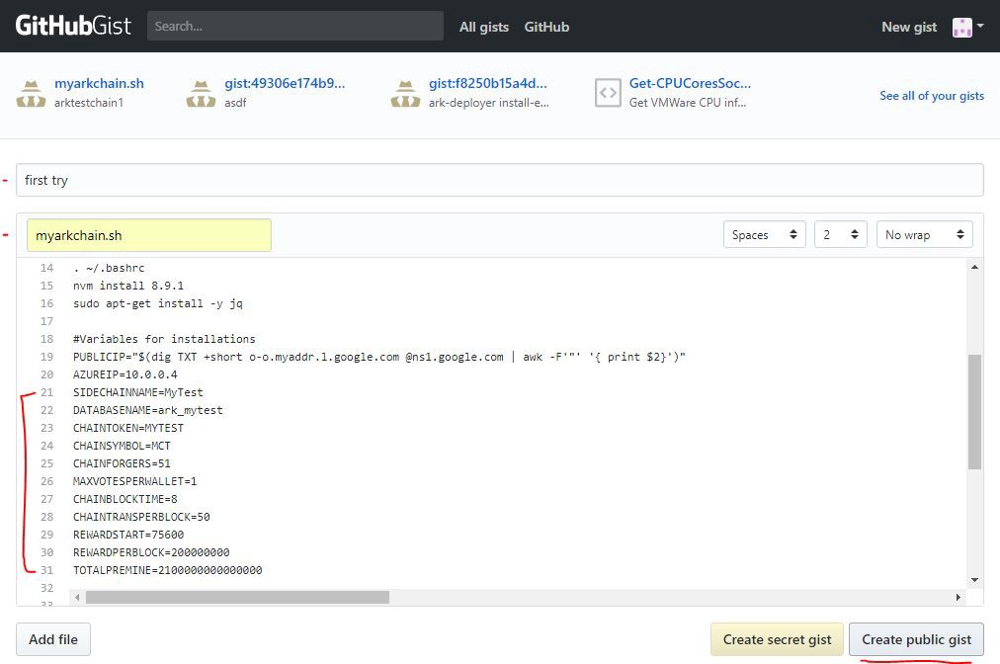

# How To Deploy Your Own PHANTOM Chain On Azure?

[[toc]]

::: tip
**This deployment method can be used to jump-start your journey to your own BridgeChain in the process [outlined here (PHANTOM Deployer)](https://docs.phantom.org/deployer/setup.html)**
:::

**Prerequisites**
Active [Microsoft Azure](https://azure.microsoft.com/en-us/) account (Trial is OK) and basic knowledge on how to connect via SSH (E.g. [PuTTY](https://www.putty.org/) for Windows).

**End result**
- Ubuntu VM in Azure
- Azure PublicIP and Firewall configurations pre-built
- Your own BridgeChain node and PHANTOM Explorer running in < 20 minutes
- Re-usable and customizable deployment script

**Script available at [PHANTOM Azure on GitHub](https://github.com/PhantomChain/phantom-azure)**

## 1. Virtual Machine Quick Deployment

Navigate to: [https://github.com/PhantomChain/phantom-azure](https://github.com/PhantomChain/phantom-azure)
Click on the big blue “Deploy to Azure” button to be taken to Portal.Azure.com. Login with your account (Trial or not, either work).


You should only need to input data for 3 empty fields (Resource Group, Admin Password, and DNS Label), but full details for this section:

**Subscription**  - If not already on your current one.
**Resource Group**  -  ‘Create New’ only option that will work unless you wish to edit the template yourself. We will use My-Phantom-RG for this guide.
**Location**  -  Choose your desired region, ensuring it allows the subscription you chose above. If in doubt, use the default region when using a Free Trial.
**Admin Username**  -  This is the account you will sign into the server with.
**Admin Password**  -  Secure string and has high complexity requirements.
**Dns Label Prefix**  -  This is the unique DNS name that you are giving to this VM. It is mandatory that this name be unique in the Location Datacenter as a whole (It will self-check after input) - Remember this for easy SSH
**Ubuntu OS Version**  -  Only option is 16.04-LTS at this time.
**PHANTOMNSG Name**  -  This is the name for the firewall group to permit SSH as well as PHANTOM Node/Explorer port access to this VM.



Currently, the VM produced is a Standard_A1 size VM. This is a very low-cost resource VM for tutorial purposes (can be scaled-up after deployment if desired or via template adjustment)

Click ‘Agree’, and ‘Purchase’ to begin deployment. Should take 5–10 minutes.

<<<<<<< HEAD
## 2. Connecting to VM + PHANTOM Deployer
=======
<<<<<<< HEAD:docs/cookbook/deployer/setup-with-azure.md
## 2. Connecting to VM + Ark Deployer
=======
## 2. Connecting to VM + PHANTOM Deployer
>>>>>>> Update setup-with-azure.md:docs/deployer/setup-with-azure.md
>>>>>>> Update setup-with-azure.md

You are welcome to explore your new VM’s Overview, etc, by clicking on ‘Resource Groups’ and finding your new group, and the VM inside. There are lots of configuration items here.

If you do not remember your Public DNS name or IP address (for SSH), go to: **Resource Groups** > **My-PHANTOM-RG** > **MyUbuntuVM** > **Overview**. This has all the general information you will need.


#### Connecting via SSH
The Public DNS Name for all VMs follows this pattern:
PublicDNSname.locationid.cloudapp.azure.com

So in our instance it would be here: **firstphantomsidechain.southcentralus.cloudapp.azure.com**



SSH into your new VM using the Public DNS Name and login with the credentials used during the VM Template deployment page.



::: tip
**Starting here, is the default quick-installation method with the chain being named “MyTest”. If you wish to customize it, please see the bottom-most section of this article.**

Run the following command (It’s a one-liner, copy and paste the full contents from here or from the **[PHANTOM Azure Github page](https://github.com/PhantomChain/phantom-azure)**)

```bash
curl -o- https://raw.githubusercontent.com/PhantomChain/phantom-azure/master/script/phantomdefaultinstall.sh | bash
```
:::

This script will complete all of the installation steps to get both the node and explorer running for your BridgeChain, with all the default values. Total installation time is about **10 minutes**.

**There is 1 important item to locate in the stream of data being output to the console (for wallet control, etc). Your Genesis Passphrase details!**
Just after the node gets installed, there will be 3 lines of text to record. Copy these lines outlined in red below.



This information will be used later on, as you explore PHANTOM past the deployment phase with [PHANTOM Deployer](https://github.com/PhantomChain/phantom-deployer). Copy and paste it right out of the console window for safe keeping.

## 3. Final result — see explorer in action


This is the Public IP of your server, and the port required to view the PHANTOM Explorer for your BridgeChain (4200). The API should be available on port 4100.

You can highlight the URL straight from the SSH window, such as http://13.65.29.3:4200 and hit CTRL+C to copy it. Paste into a browser, and voila!



## 4. Customizing Your Deployment

If you wish to customize your deployment of PHANTOM within the bounds of PHANTOM Deployer, download a copy of the [Azure Shell script](https://raw.githubusercontent.com/PhantomChain/phantom-azure/master/script/phantomdefaultinstall.sh).



Within this file, you’re welcome to edit the list of variables on lines 21–31 and personalize them. These variables all align with an optional parameter of PHANTOM Deployer (See GitHub: [https://github.com/PhantomChain/phantom-deployer#optional-parameters](https://github.com/PhantomChain/phantom-deployer#optional-parameters))

You can then run this new version of your script against a new VM, or, you can uninstall the original node/explorer and re-install using the script again. We would recommend just rolling out a new server for ease of use, but that’s your call.

**To quickly make a personalized copy of the script (GitHub account)**

- Go in browser to: [https://raw.githubusercontent.com/PhantomChain/phantom-azure/master/script/phantomdefaultinstall.sh](https://raw.githubusercontent.com/PhantomChain/phantom-azure/master/script/phantomcoredefaultinstall.sh)
- Copy the contents of this file (ALL of it; Just CTRL+A and CTRL+C)
- Open a new tab to [https://gist.github.com/](https://gist.github.com/)
- Paste contents of clipboard to this file, and customize lines 21–31 to your hearts content. These variables all align with an optional parameter of PHANTOM Deployer (See GitHub: [https://github.com/PhantomChain/phantom-deployer#optional-parameters](https://github.com/PhantomChain/phantom-deployer#optional-parameters)).
- Create a ‘Public Gist’ with a .sh file name (required)



Click on “Raw” on the same line as your file name and copy the URL.

You can now, on a prepared VM, run via SSH:

```bash
curl -o- paste-raw-gist-URL-here-ending-in.sh | bash
```

For more in-depth and customizable BridgeChain enjoy following along with the [PHANTOM Deployer](https://blog.ark.io/ark-deployer-setup-guide-c10825ebb0e4) guide going forward in your PHANTOM journey. 

## Special Mention

"Special thanks to [Walrusface](https://medium.com/@walrusface) for writing this guide and script, delegate [Jarunik](https://medium.com/@jarunik) for sponsoring its development and our dev [Alex Barnsley](https://medium.com/@alexbarnsley) for testing and modifying necessary things" in PHANTOM deployer. The PHANTOM team has modified it to match our forked version.
