# Running a Relay Node
Phantom offers an easy to setup solution for running a relay node for v2 with [Core Commander](https://github.com/PhantomChain/core-commander).

The experience is similar to the old solution for v1: Phantom Commander.

Core Commander only supports Ubuntu (16.04, 18.04).

Docker images for running a relay node with configurability can be found [there](/cookbook/exchanges/docker).

## Requirements
 - 4GB RAM
 - 40GB SSD
 - 2 Cores

## Instructions
On a fresh Ubuntu installation, follow these commands

1. Update and Upgrade
```sh
sudo apt-get update && sudo apt-get upgrade
```

2. Add new user and add to sudo group
```sh
sudo adduser username
sudo usermod -aG sudo username
```

3. Login to the new user account and clone Core Commander
```sh
sudo su - username
git clone https://github.com/PhantomChain/core-commander
```

4. Execute commander.sh with bash
```sh
bash core-commander/commander.sh
```

5. Enter your sudo password
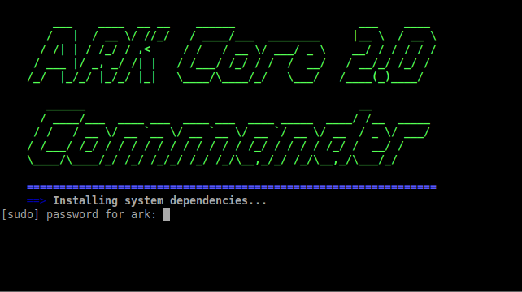

6. Let Core Commander install software dependencies
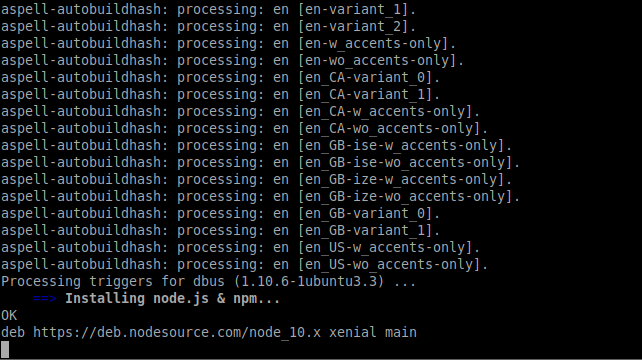
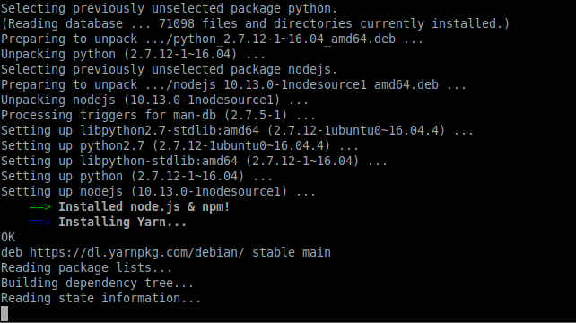
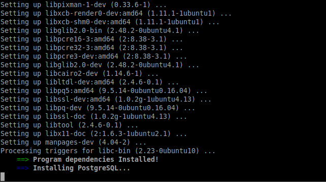
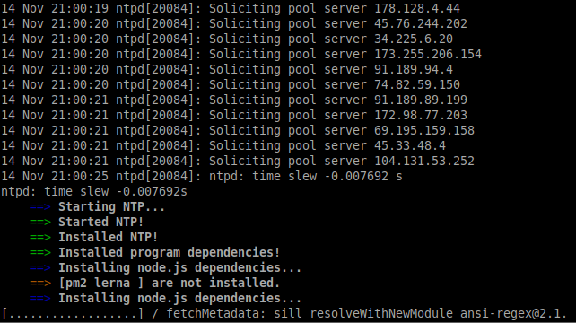

7. Reboot your system
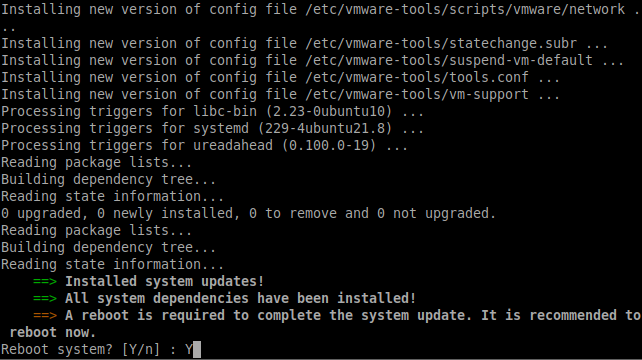

8. Log back in and run Core Commander with bash again
```sh
username@host:~$ bash core-commander/commander.sh
```

9. You will be told that your system is up to date
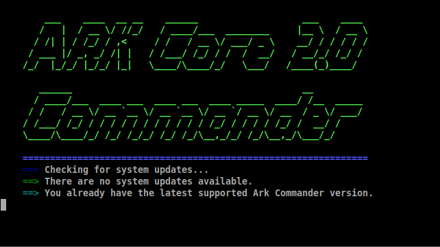

10. Choose `I`, `ENTER` to Install Phantom Core on the main menu
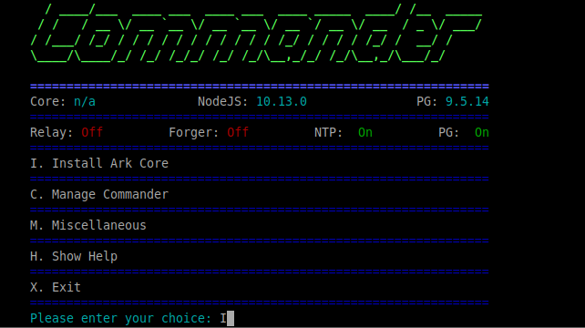

11. Let Core Commander clone and build Phantom Core
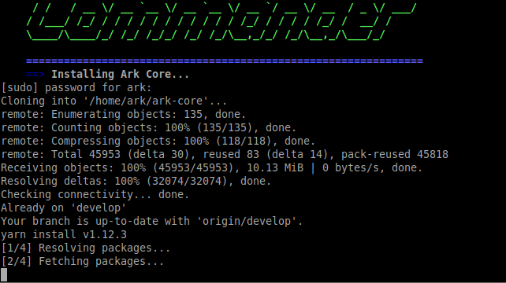

12. Choose your network version
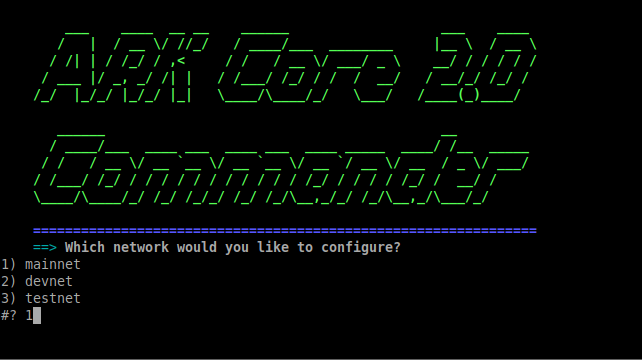

13. Configure database settings and log level for your setup
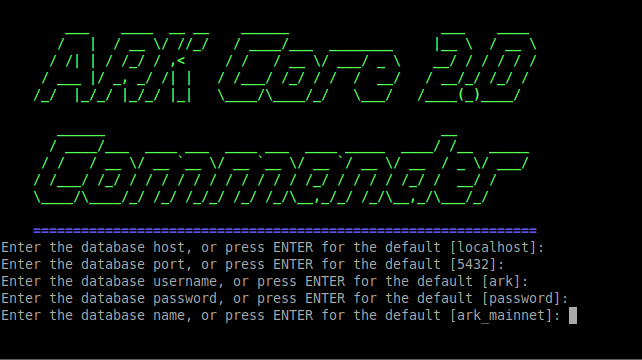
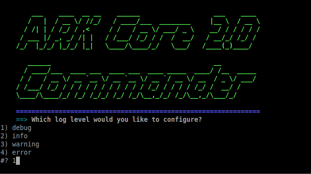

14. Start the relay node
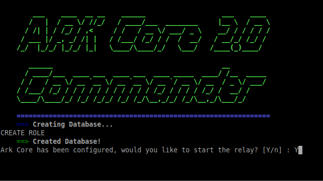

15. Monitor the sync progress with `R`, `ENTER`, `L`, `ENTER`
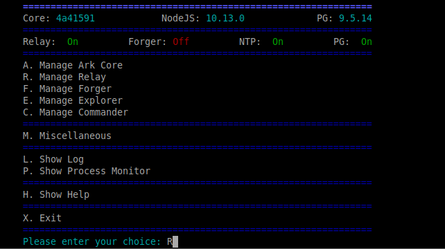
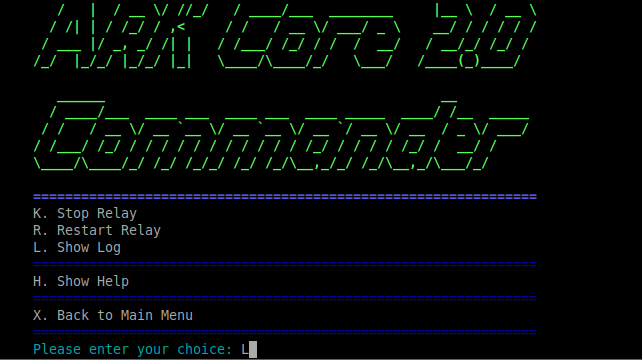
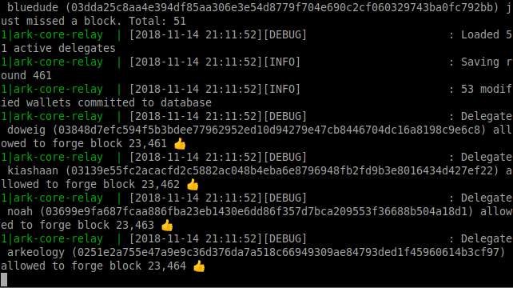

The node will sync and the messages will show you when it is ready to be used.

## JSON-RPC

Now that the relay is setup you can head over to the [JSON-RPC installation guide](/cookbook/exchanges/installation.html) if you wish to use the JSON-RPC to manage your wallets and transactions.

## Notes

Please read the documentation pages for all of our [Phantom Client and Crypto libraries](/api/sdk/) (offerred in many programming languages).

Also, read the [API documentation](/api/public/v2/).
