# How To Use The Desktop Wallet?

[[toc]]

### What is it?

The PHANTOM Desktop Application is the primary software that most users will utilize to store, send, receive, vote and do much more with their PHANTOM. The desktop application/client interfaces with your wallet and allows you to interface with PHANTOM!

This User Guide is for the everyday, non-developer PHANTOM consumer.

### First things first...

We first have to download the PhantomClient to get started:

[PhantomClient Download](https://github.com/PhantomCore/desktop-wallet/releases)

::: warning
**Note**: The above link is the authoritative source for the latest PhantomClient. As a friendly reminder, don't ever click on links that are not sponsored by or provided by the Official PHANTOM Team
:::

When you arrive on this page you will see multiple options for the PhantomClient. Select the one that reflects your operating system:

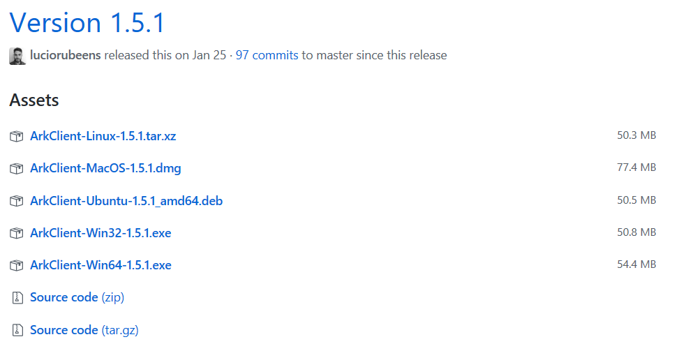

___

## Creating your PHANTOM Wallet

Your PHANTOM Wallet is a unique address that will store your ZINC.

1. Open the PhantomClient.
2. Select "CREATE ACCOUNT".

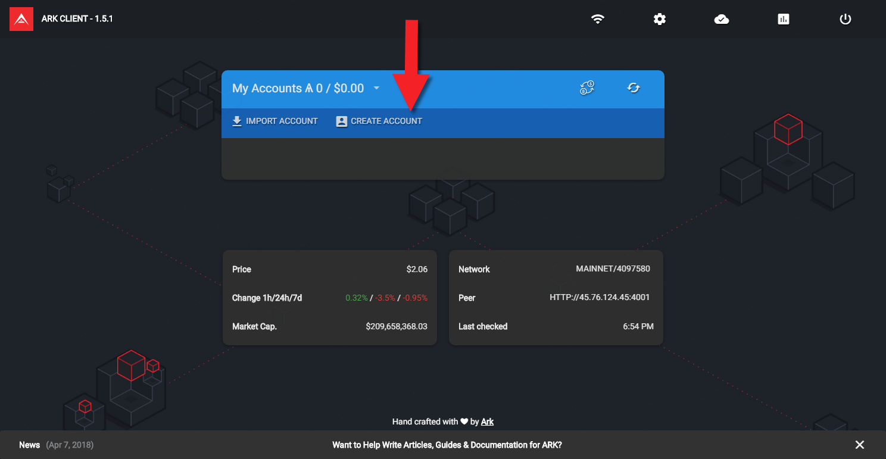

3. You will now be presented with your passphrase. It is **paramount** you copy it down as instructed.

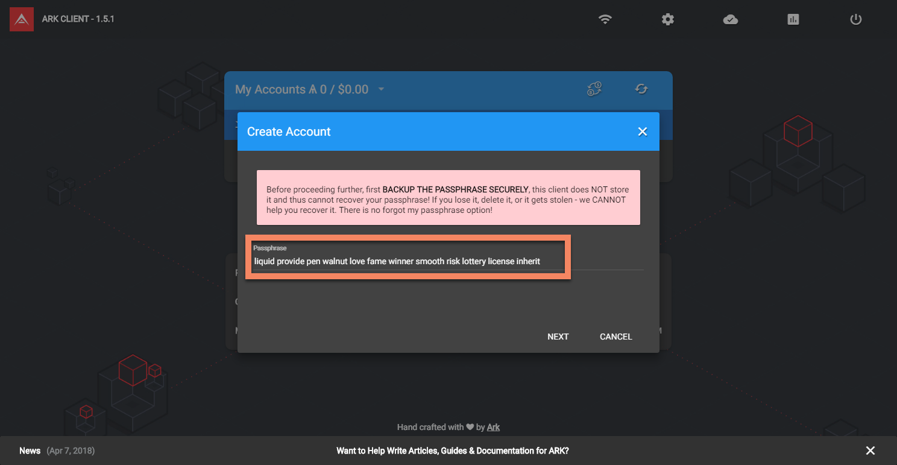

**WARNING:** As noted in the alert, *nobody* can recover your passphrase for you if it is lost. Not the PHANTOM Staff, developers, or delegates. It is your responsibility to accurately copy and store it securely. This is the only key to your wallet.

4. You will now be prompted to verify the previously provided passphrase by entering the corresponding words. Enter them and select "CREATE".

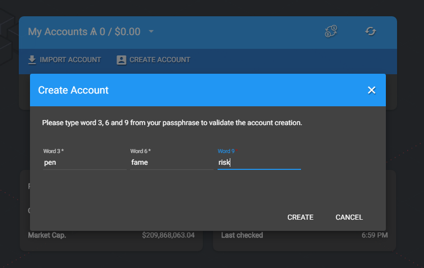

5. Congratulations! You now have your very own PHANTOM Wallet. It's that easy!

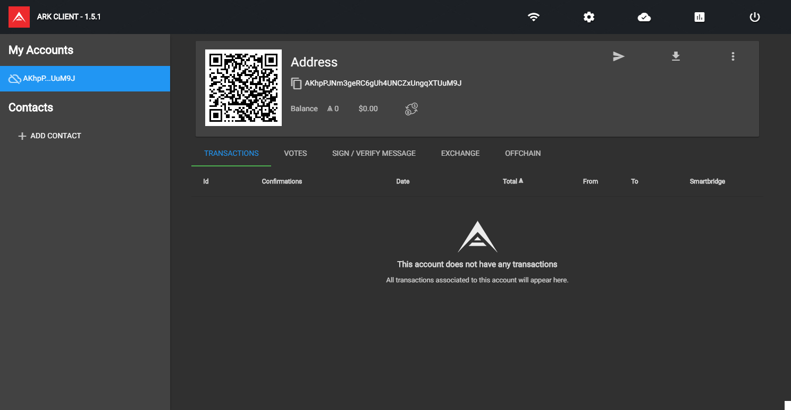

___

### Identifying your PHANTOM Wallet Address

Your PHANTOM Wallet address is presented to you at the top of the client, under 'Address' and to the right of the *Copy* icon. This address is 100% unique to your wallet. You will need this address in the future to send ZINC to your wallet. You can automatically copy is by simply clicking on it.

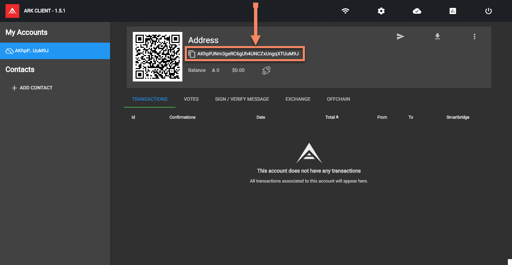

___

## Sending ZINC to your PHANTOM Wallet (*from an exchange*)

Your PHANTOM Wallet stores your ZINC for you. In order to interface with PHANTOM you need to add some to your wallet.

1. First you will need to obtain some ZINC, which is available across many exchanges today and growing regularly. You can find a list of exchanges here: [https://phantom.org/exchanges](https://phantom.org/exchanges)

2. Once you've obtained some ZINC you will be ready to send your ZINC to your PHANTOM Wallet.

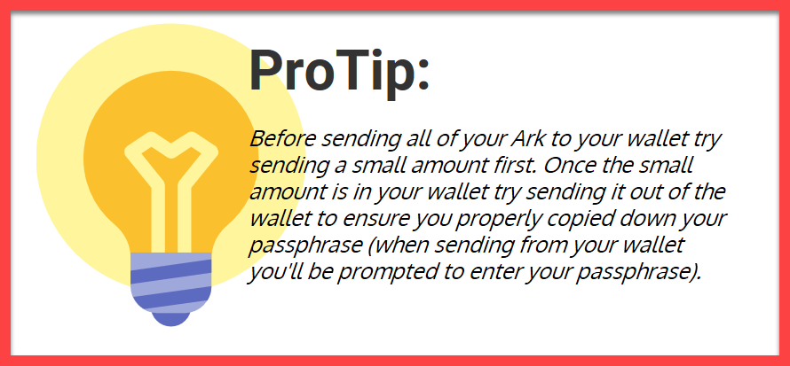

3. Enter your PHANTOM receiving address and send the ZINC to your PHANTOM Wallet.

4. Your ZINC will be sent on it's way to your PHANTOM Wallet! You will soon be able to see your new ZINC balance in the PHANTOM Desktop Application!

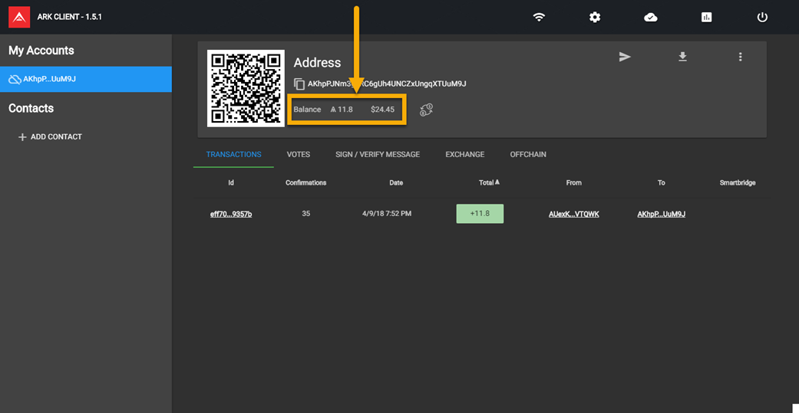

___

## Sending ZINC from your PHANTOM Wallet

Now that your have a balance of ZINC in your wallet, you may want to send it out. Someone may want to send ZINC to another PHANTOM Address for any number of reasons, perhaps you want to sell your ZINC, pay for a good or service, or donate ZINC to the PHANTOM Community Fund. Sending ZINC is quick & easy.

1. Within your PHANTOM Desktop Application and within your wallet, you will see an arrow pointing to the right in the top right hand corner of the PHANTOM Address box. This is the send icon. Select it.

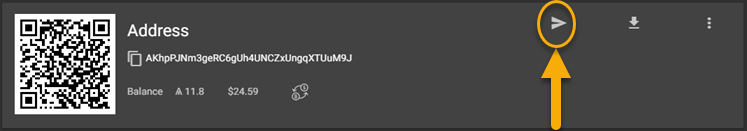

2. Now you are in the send box. The 1st line you see will be the PHANTOM Address line you are *sending* your ZINC to. To the left of the line is a QR Scan function. If you click it (and have a web cam hooked up to your computer) you will be able to scan the QR code of the PHANTOM Address you wish to send to and the address will automatically propagate to the PHANTOM Address line. Otherwise you will simply copy and paste the address you're sending to.

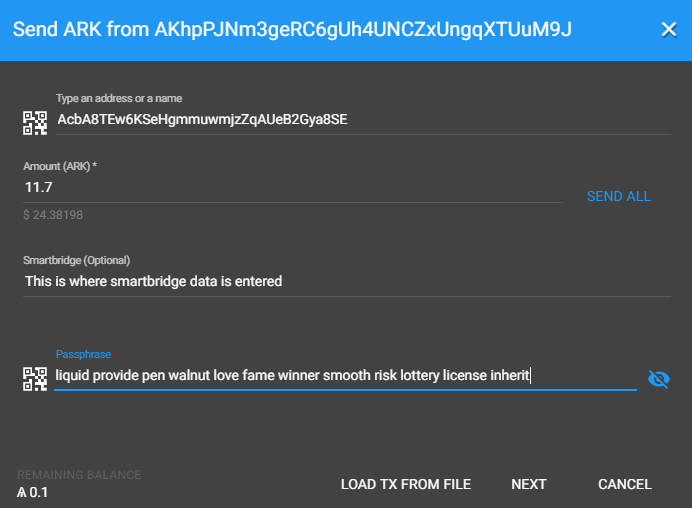

3. The next line is the amount of ZINC you wish to send. If you'd like to send you're entire balance select the "SEND ALL" option and your entire balance will propagate to that line.

4. Smartbridge data is not required. It can be used in specific and unique instances. Ignore it at this time.

5. The final line is where you will enter your passphrase. Your passphrase must be entered exactly as it was presented to you. It is all lower case, 12 words, 1 space between each word, and no space at the end.

6. When you're ready to send select "NEXT".

7. You'll now see a Transaction box, confirm all information is correct and select "SEND NOW".

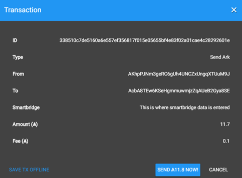

8. All done! Your ZINC is on its way to its destination address!

___

## Voting with your PHANTOM Wallet

Voting or otherwise known as staking your ZINC has several purposes. By voting for a delegate you help secure the PHANTOM network (most importantly), and the lure of voting is that most delegates provide an incentive for voting for them by rewarding you with ZINC on a periodic basis (amount and how often paid differs between delegates). Some think of this as interest earned for their ZINC.

Each delegate is unique and brings different skill sets to the PHANTOM Ecosystem, so before voting for who you think should be entrusted with securing the PHANTOM network you should conduct your due diligence and research the delegates. More information about the delegates and frequently asked questions regarding voting and delegates can be found in the [Frequently Asked Questions](#FAQ) and [Appendix/Useful Links](#appen) section towards the bottom of this User Guide.

1. Within your PHANTOM Wallet you wish to Vote with, select the "VOTES" tab, located directly beneath your wallet address box.

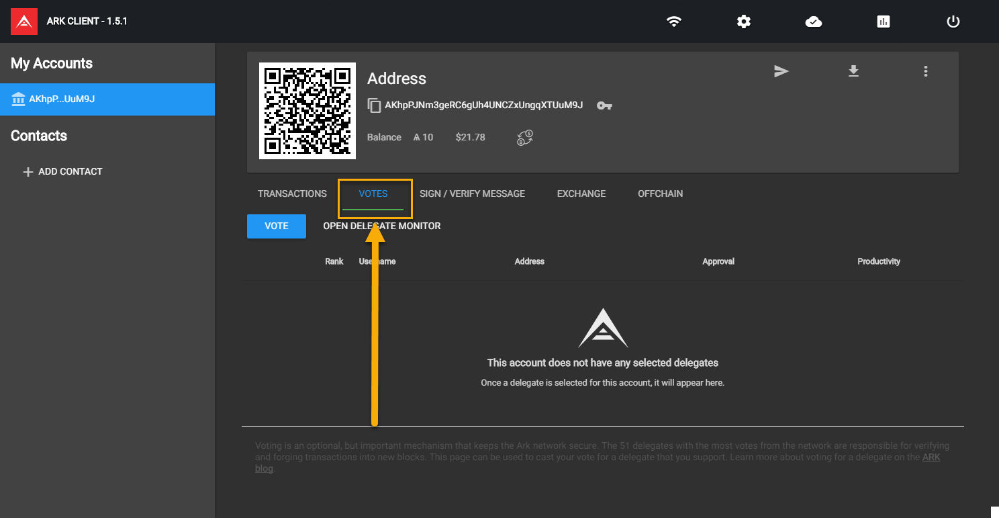

2. You will now see a blue box that says "VOTE" within it, select it.

3. A new box will appear labeled "Vote". The first selection is a drop down labeled "Active delegates (forging)". Select it.

4. You will now see a list of the top 51 delegates that are currently forging blocks. (*learn more about what this means in FAQ*)

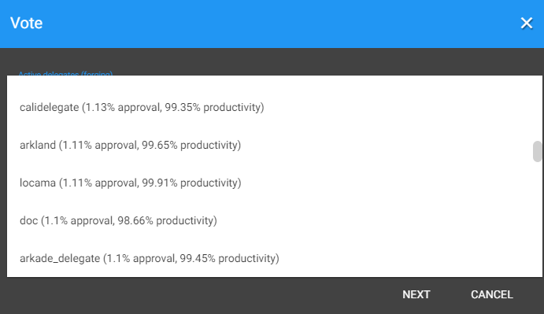

5. For the sake of example we are selecting delegate "genesis_51". Input your passphrase on the next line and select "NEXT".

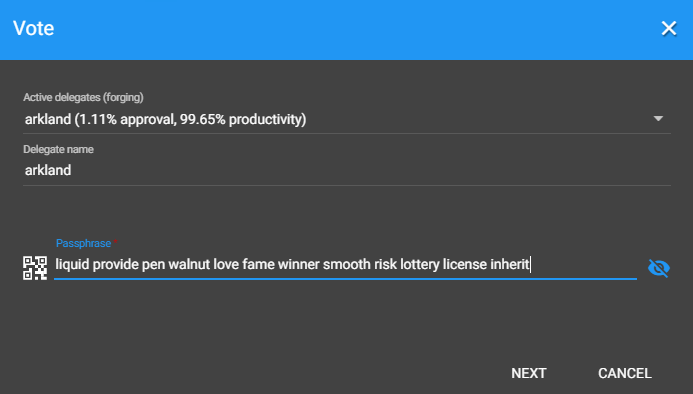

6. In the next window you will be prompted to send ZINC in order to vote, this is a voting fee required that may change over time. When you're ready to vote for your selected delegate select "SEND NOW".

7. You will now see within the "Vote" tab your delegates rank (within top 51, for this example genesis_51 is # 19), your delegates name, their wallet address, their approval and productivity. You will also see an "UNVOTE" option which will be reviewed in the next section. You are now voting/staking your ZINC for your selected delegate.

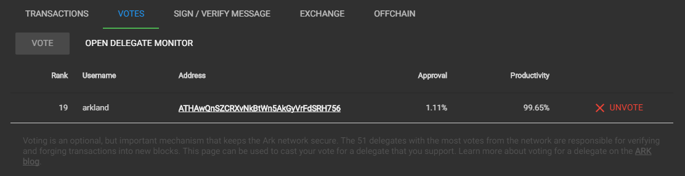

___

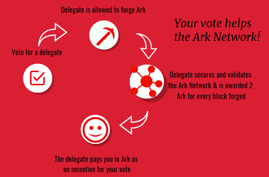

___

## Unvoting a delegate

If your delegate is not contributing to the PHANTOM community in a way he/she had promised, isn't paying their voters, or maybe a different delegate simply seems more attractive to you, you may wish to unvote your delegate.

1. Within the "VOTES" tab in your wallet you will see the current delegate you are voting for. To the far right you will see "UNVOTE", select it.

2. A window will appear labeled "Remove Vote". Below that you will see your delegates name. On the next line input your passphrase. Select "NEXT".

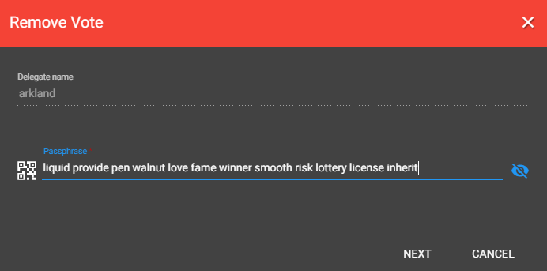

3. You will now be prompted to send the required ZINC fee in order to unvote your delegate. Select "SEND NOW".

4. You will now notice your delegates name is no longer within the "VOTES" section. You have unvoted your delegate.

___

## Various functions & featues within the PhantomClient/Desktop Application

The PhantomClient/Desktop Application offers a myriad of functions and features for the user to explore and utilize. This User Guide will cover and explain some of the features most often used by the average user.

### Appearance

You may change the background or theme in your PhantomClient to fit your personal style and flavor.

1. From the homescreen or within your wallet the ribbon along the top of the client remains stationary. There is a gear icon for settings. Select it.

2. A dropdown list will appear, you will see "APPEARANCE" at the bottom. Select it.

3. You will be presented with multiple options to suit your preference. Select one, and when you're done select "SAVE". Your new background or theme will be set.

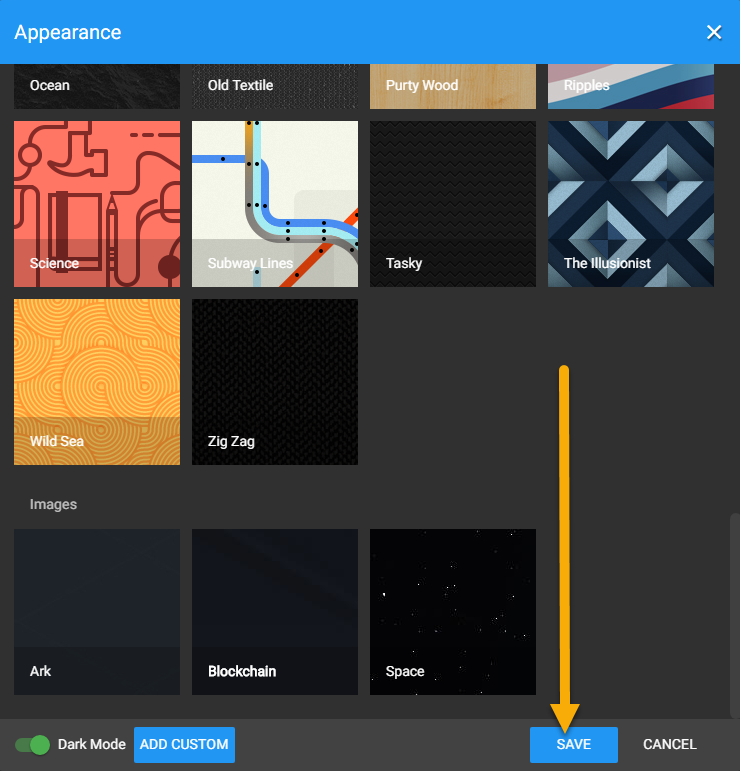

You may also choose to set a background picture from your personal selection of pictures.

1. From the homescreen or within your wallet the ribbon along the top of the client remains stationary. There is a gear icon for settings. Select it.

2. A dropdown list will appear, you will see "APPEARANCE" at the bottom. Select it.

3. At the bottom left you will see an option, "ADD CUSTOM", select it. Now, navigate to the photo you wish to load into PhantomClient. Select it and select "OPEN".

4. Scroll up to the top of the background/theme selections. Your custom photo will be there. Select it, then select "SAVE". Your custom photo is set.

___

### Renaming your PHANTOM Wallet

Instead of your PHANTOM Wallet Address displaying on the homescreen of the PhantomClient you can choose to rename/relabel your PHANTOM Wallet to what you wish. A couple reasons for wanting to rename your PHANTOM Wallet could be you have multiple wallets and wish to easily distinguish between them, or perhaps you have different wallets for different purposes.

1. Select the wallet you wish to give a new label.

2. At the top right corner of your PHANTOM Wallet Address box you will see 3 vertical dots. Select it.

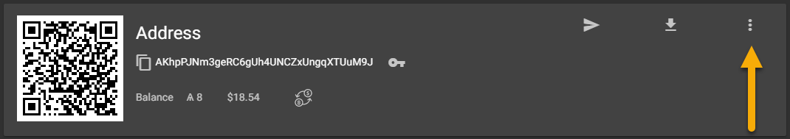

3. You will notice a new ribbon of options appear at the bottom of your PhantomClient. Select the "LABEL" option.

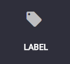

4. A new box will appear titled "Label". You will see your current PHANTOM Address prefilled on the line. Overwrite it with what you wish to name your wallet. When you're done, select "SET". (*don't worry, this doesn't 'delete' your PHANTOM Address.*)

5. You will now see your wallet renamed to whatever you set it as. In this example we labeled it "My Main Wallet".

**Note:** This new label can only be seen by you in your PhantomClient.

6. If you navigate to the PhantomClient homescreen (by selecting "PHANTOM Client" in the upper left hand corner) you will also see the newly labeled wallet there. You have completed Renaming your PHANTOM Wallet.

___

### Adding a second passphrase

You can add a second passphrase to your PHANTOM Wallet for an added layer of security. You may want to do this if you have a large amount of PHANTOM or if you believe somebody else may know your first passphrase (or most of it).

**Note:** By adding a second passphrase you will be required from that point forward to use both your first and second passphrase to send transactions. You cannot remove the second passphrase once it is added and it is just as important to keep safe and kept secure as your first. This is usually not advised for the average user.

1. At the top right corner of your PHANTOM Wallet Address box you will see 3 vertical dots. Select it.

2. You will notice a new ribbon of options appear at the bottom of your PhantomClient. Select the "SECOND PASSPHRASE" option.

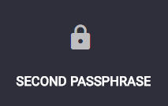

3. A warning box will appear advising you it will cost you 5 ZINC to add a second passphrase. Select "CONTINUE".

4. A new window titled "Create Second Passphrase" will appear. The warning to copy your passphrase exactly will also be present, and below that will be your second 12 word passphrase. Copy it down exactly and verify you have done so. Select "NEXT".

5. The next window titled "Create Second Passphrase" will ask for your first passphrase and your new second passphrase. Input them and select "CREATE".

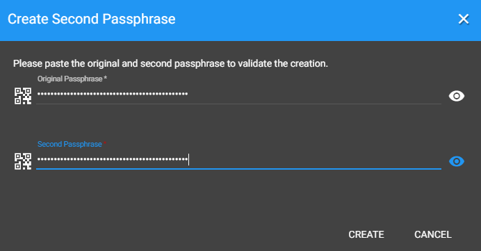

6. The next window will provide transaction details. To add the second passphrase select "SEND 5 ZINC NOW".

7. Your second passphrase has been added to your wallet.

___

### Remove wallet from Client

You may want to remove a wallet from the PhantomClient if you have multiple wallets and you have some wallets you don't use anymore, or you're using a shared computer and don't want your wallets information to populate for when the next user opens PhantomClient. Removing a wallet is easy and will **not** delete your wallet and it's contents. You can learn how to re-import your removed wallet in the next section.

**Note:** If you remove your wallet from the client and later import that wallet back, any previously added labels will be gone.

1. At the top right corner of your PHANTOM Wallet Address box you will see 3 vertical dots. Select it.

2. You will notice a new ribbon of options appear at the bottom of your PhantomClient. Select the "REMOVE" option.

3. A box will appear titled "Remove Account (your-phantom-address)". Select "REMOVE ACCOUNT".

4. You wallet is now removed from that PhantomClient.

___

### Import Account

You may want to import an account if you're on a new computer, newly downloaded PhantomClient, or if you previously removed your wallet from the client.

1. On the PhantomClient homescreen select "IMPORT ACCOUNT".

2. A box titled "Import Account" will appear and ask for your passphrase.

3. Input your passphrase and select "IMPORT".

4. Your wallet is now imported into the PhantomClient.

___

### Export Account

You may want to Export your account to keep track of the data within your wallet in a separate text file or there may be a program that will utilize the data and interpret it for you. The PhantomClient will export your
account in a .csv file (commonly known as a flat file).

1. At the top right corner of your PHANTOM Wallet box you will see a downward facing arrow to a horizontal line. When you hover your cursor over it it will display "Export Account". Select it.

2. A new window will appear titled "Export account". You will be prompted to select a start and end date to choose the range of transactions to be included in your export file. Choose your range and select "START EXPORT".

3. The next window will appear and show you how many transactions were included in your export.

4. Select "DOWNLOAD FILE". The default file name will be your PHANTOM Wallet Address. Select where you'd like to save your file and save. You have exported your account.

___

### Timestamp a File

With the PhantomClient you can timestamp a file on the PHANTOM Blockchain. PhantomClient will hash the file with SHA256. Hashing provides a unique string of characters based on the data within the file (does not include meta data). If so much as a period is removed from the file (in a text document for instance) the unique string will be vastly different. This provides proof of authenticity for the file and the timestamp provides the instance in time existed exactly as it is. This data being written to the PHANTOM Blockchain provides immutable proof of a documents authenticity.

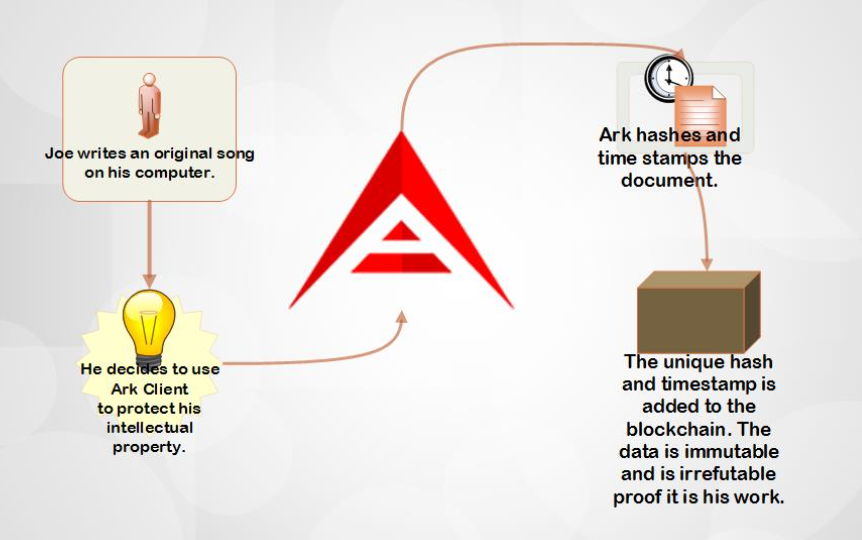

1. At the top right corner of your PHANTOM Wallet Address box you will see 3 vertical dots. Select it.

2. You will notice a new ribbon of options appear at the bottom of your PhantomClient. Select the "TIMESTAMP DOCUMENT" option.

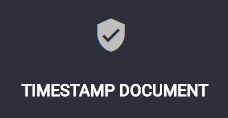

3. A new box will appear titled "Timestamp Document On (wallet address)". Select "OPEN FILE" to be hashed and timestamped and select your file. Input your passphrase and select "NEXT".

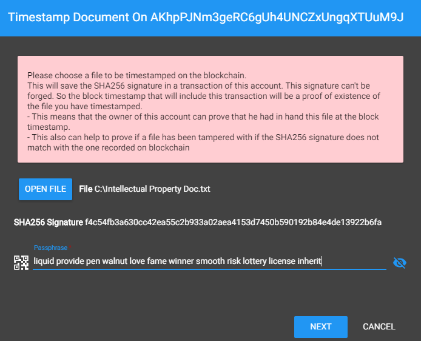

4. On the next screen transaction details will be provided. Select "SEND NOW" to complete.

5. You'll notice within your wallet transactions the SHA256 hash in the Smartbridge column, and the time & date it was committed to the blockchain in the Date column. Timestamp document complete.

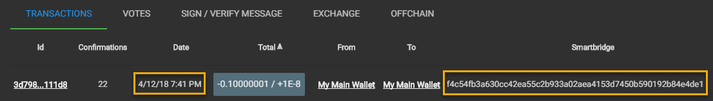

*More about hashing and timestamping can be found in the [FAQ](#FAQ) & [Appendix/Useful Links](#appen) sections of this User Guide.*

___

### Different settings within PhantomClient/Desktop Application

##### Currency

PhantomClient is automatically set to USD. If you want the PhantomClient to display ZINCs current exchange rate with your preferred currency (if available) you can change it so it appears by default on the homescreen and within your wallet.

1. From the homescreen or within your wallet the ribbon along the top of the client remains stationary. There is a gear icon for settings. Select it.

2. A dropdown list will appear, you will see "CURRENCY" and a dropdown to the right of it defaulted on "USD".

3. Select the dropdown and choose your currency of preference, then click out of the dropdown box.

4. Your selected currency is now set as the default currency.

____

##### Price

You can view the current price each ZINC is trading for on your homescreen, it will be displayed as your set currency rate. Price changes are also provided by 1 hour, 24 hour, and 7 days % change increments.

The price is retrieved from <https://coinmarketcap.com/>

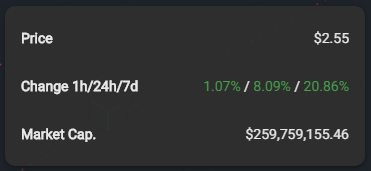

___

##### Language

PhantomClient is automatically set to English as the default language. You can change this to your preferred language in settings.

1. From the homescreen or within your wallet the ribbon along the top of the client remains stationary. There is a gear icon for settings. Select it.

2. A dropdown list will appear, you will see "LANGUAGE" and a dropdown to the right of it defaulted on "ENGLISH".

3. Select the dropdown and choose your language of preference.

5. Your selected language is now set as the default language and the PhantomClient will reflect it.

___

### Add Contacts

You may want to Add Contacts within your PhantomClient to easily identify owners of wallets that you interact with. This will also make that wallet more readily available for you to interact with and provide some transaction data.

1. For the contact you wish to identify you will need to have their wallet address copied.

2. With your wallet open you will see on the left hand side of the PhantomClient "+ ADD CONTACT". Select it.

3. A new window will appear titled "Add Contact". On the first line input the name you wish to identify that wallet as. On the second line paste the wallet address you have copied. Select "ADD".

5. You will now see that contact added on the left hand side of the PhantomClient. If you hover your cursor over the "i" (information) icon within that contact you can see transactions between you and that wallet/contact. You have completed Add Contacts.

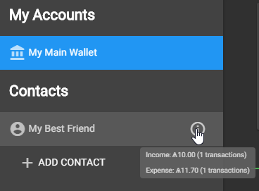

___

### Frequently Asked Questions

*Q: What happens if my PhantomClient/Desktop Application gets deleted/uninstalled? Do I lose all my ZINC?*

**A: No. You simply need to reinstall the PhantomClient and [re-import](#import) your wallet using your passphrase.**

*Q: What happens if I lose my passphrase? Is there any way to recover it?*

**A: No. This cannot be stressed enough, it is your responsibility to correctly copy down your passphrase and secure it to the best of your ability. If your passphrase is lost your wallet cannot send transactions and there is nothing the PHANTOM Staff, developers or delegates can do to help you.**

*Q: If I added a second passphrase to my wallet can I still send transactions if I lost my second passphrase? Is there a way to remove the second passphrase?*

**A: If you do not know your second passphrase you will not be able to send transactions. The second passphrase is just as important as your first passphrase. However, you will be able to import your wallet with just your first passphrase and view it. But you will not be able to use the ZINC in it without the second passphrase.**

*Q: How long does it take to transfer ZINC to/from an exchange?*

**A: The time it takes to send ZINC to/from an exchange may vary depending on how busy that exchange is. If an extensive amount of time has lapsed (days, although this should not happen) you may want to contact a delegate to assist you.**

*Q: If I am already voting for a delegate and I add more ZINC to my wallet, do I need to revote for the delegate for that ZINC to count?*

**A: No. Most delegates check your wallet weight on every block they forge.**

*Q: How fast are ZINC blocks forged?*

**A: A block is forged every 3 seconds. Each block forged creates 4.5 ZINC.**

*Q: What does "top 51" delegates mean? Are there more delegates?*

**A: Only the top 51 delegates with the most votes are allowed to forge/validate/secure the PHANTOM Network. It is up to the community to keep the most trusted/honest delegates in charge of doing so. This creates a democracy of sorts, giving power to the PHANTOM ZINC holders.**

*Q: Can I vote for 2 delegates at the same time with 1 wallet?*

**A: No. You can only vote for 1 delegate with each wallet. 1 ZINC = 1 Vote for 1 Delegate. This system ensures individuals with large amounts of ZINC cannot act maliciously by voting for multiple delegates with one wallet.**

*Q: When can I expect payment from my delegate?*

**A: Payment from your delegate depends on various things like the amount of ZINC you're staking and their payout frequency and minimum payout amount. You can learn more about this in the delegate proposals subreddit. Link provided in [Appendix](#appen).**

*Q: If I am voting for a delegate can I still send or use my ZINC or is it ‘locked’ up? Do I keep my ZINC when I vote?*

**A: Your ZINC is not given away to the delegate nor is it locked up. It is still your ZINC and you can do with it what you wish.**

*Q: Does my wallet need to be open and running for my vote to count and collect payout?*

**A: No, your PhantomClient does not need to be running. Simply vote for your delegate and your vote counts.**

*Q: Will timestamping my file make it viewable to others that explore the blockchain?*

**A: No, your timestamped document is not viewable to others. However, the transaction is viewable to everyone. If someone is viewing your wallet they will be able to see the transaction. (date, and hash in the Smartbridge data, but the hash is useless to them, they cannot decrypt it.)**

*Q: By adding a contact and assigning a name, will others also see that name I've given them?*

**A: No, the name you assign a wallet is unique to you and only you see it that way.**
