# How to Use the Mobile Wallet

## The Preparation

The PHANTOM Mobile Wallet is a great way to access your XPH coins, it's fast and easy and while being mobile, it can securely store the data using PBKDF2 algorithm and AES-256 encryption protected by a created PIN code. This guide will show you where to get the mobile wallet on Android and iOS devices and help you with installing it! The mobile wallet has no need to download the blockchain, but can vote for a delegate, and send/receive XPH. Whether you're importing a wallet or generating a new one the wallet will have all the features you need.

Before we begin, we're going to need to download the mobile wallet. If you have an Android device you can download the mobile wallet [here!](https://play.google.com/store/apps/details?id=io.ark.wallet.mobile&hl=en_US)

Now for iOS devices we are currently waiting for Apple approval.

## Starting the PHANTOM Wallet

Once you load the application you will be met with this screen:

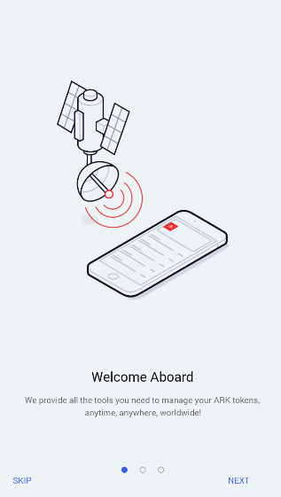

You may skip the introduction or continue by hitting Next on the bottom right hand corner of your screen. If you hit Next, you will see the following screens:

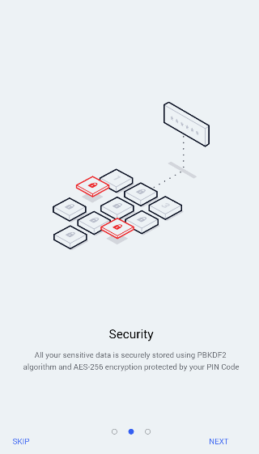       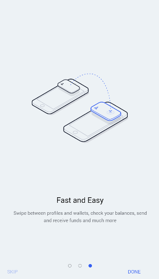

When we've either skipped or proceeded, you will be asked to create your profile:

After you hit the '*Create A Profile*' button, you will be asked to create a 6 digit PIN and then confirm the PIN.
**You will need to remember this PIN**.

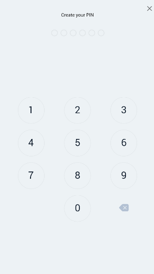

You will be asked to create a name for your profile. You can create one for the Mainnet or the Devnet, which is the Development Network. For this guide we will be on the Mainnet.

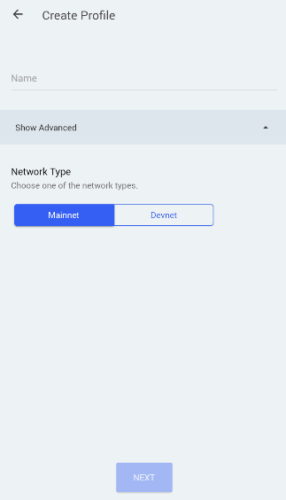

Once you've placed your name, you can sign in by touching onto the profile you created and by entering in the PIN you created earlier. From here, you can follow the prompts and click on the button that's displayed on the screen to import or create a wallet. If you are importing a wallet, click [here](#importWallet). If you are creating a new wallet, continue reading.

## Creating a wallet

If you choose to generate a wallet and follow the prompts you will be shown your shareable Public Address and your Secret Passphrase. **Keep your secret passphrase safe and secure**, without it you will not be able to restore your wallet, send transactions, and you will **lose all of your XPH coins**.

After hitting '*Next*', you will be asked to input 3 of the words in your Secret Passphrase. Once you've placed the appropriate numbered word into its field, you will be asked to put in your PIN again. The next screen will show you the amount of XPH coins you have in your wallets, your shareable Public Address, the Market Value of XPH in USD, Satoshi's, and the 24 hour Change.

             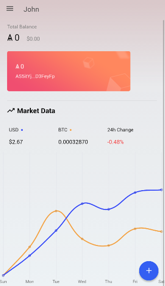

## Importing a wallet

If you choose to import a wallet and follow the prompts, you will have two options to import your wallet: QR Code or by putting in your secret passphrase or address manually.

**If you decide to copy and paste your information into the app, make sure your device does not add a space after your passphrase or address. If the space is there, it will create a new wallet and not import your own wallet**.

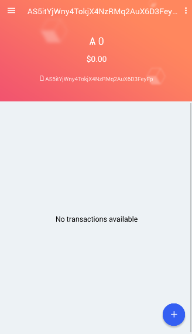

## The PHANTOM Wallet

You are able to hit the triple bar in the top left corner, doing so will give you numerous options for you to select. 

Choosing *'Wallets'*, will place you at the main Phantom Wallet balance screen. After you reach the main Phantom Wallet balance screen, you are able to add another wallet, touch the triple bar on the top left corner, or choose an existing wallet to view even closer.

If you want to add another wallet, you would push the blue circle we used earlier to create or import a wallet.
If you hit the triple bar on the top left corner, you get numerous options where you are able to view and select:
- Main wallet balance screen
- Vote for delegates
- Change the peer to the network
- Enter the settings, where you may change or view your:
  - Language
  - Currency
  - PIN
  - Clear your Data
  - Privacy Policy
  - Version Number
 - Contacts
  - You are able to save contacts by name and PHANTOM Address for quicker sending/receiving
 - Sign Out

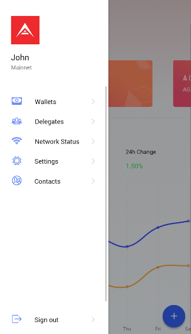            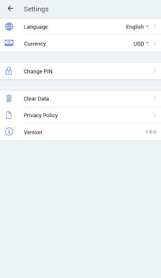

If you want to view an existing wallet and the transaction history, you will need to touch the rectangle(s) right below the 'Total Balance' text.

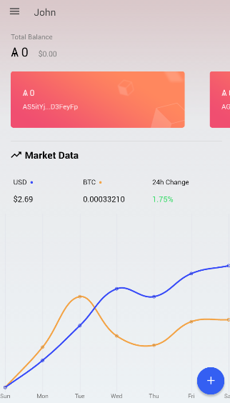

Once inside a wallet, you are able to view incoming and receiving transaction history, the public address, the PHANTOM wallet balance and by touching the vertical ellipsis you are able to:
- Register a Delegate
- Vote for a Delegate
- Rename your wallet
- Backup your Wallet
- Delete your wallet

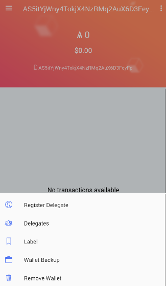

## Voting

To begin voting, we need XPH in our wallets. Once you've transferred XPH to your wallet, you will want to click on the wallet that was either imported or generated.

Once the wallet has been selected, hit the triple bar and choose *'Delegates'*. This will show you the top 51 Active Delegates and the delegates on Standby

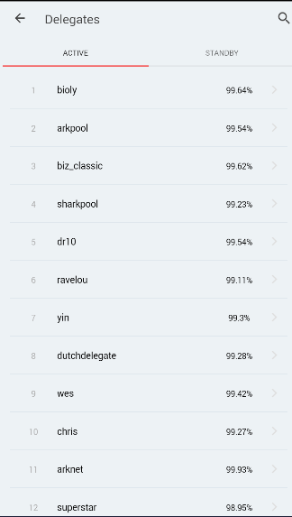               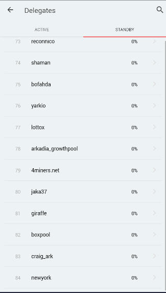

Choosing a Delegate will prompt you to vote for 3 XPH.

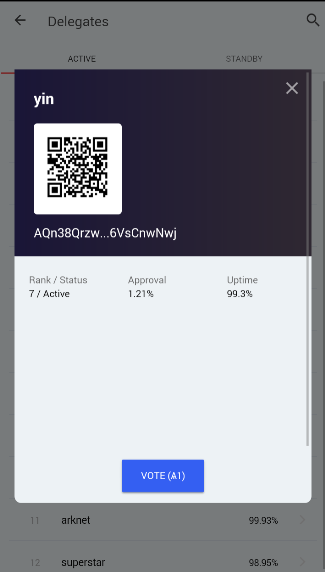

If you have any questions regarding how much you will receive from voting for a delegate, you can find that [here](http://calculator.reconnico.com/).

## Conclusion

Your PHANTOM Mobile Wallet is now ready for use! That's all it takes to install the PHANTOM wallet. If you have any questions regarding voting and delegates, take a look at PAHNTOM's [FAQ](https://blog.ark.io/ark-frequently-asked-questions-faq-bcb90a0537cc)!
