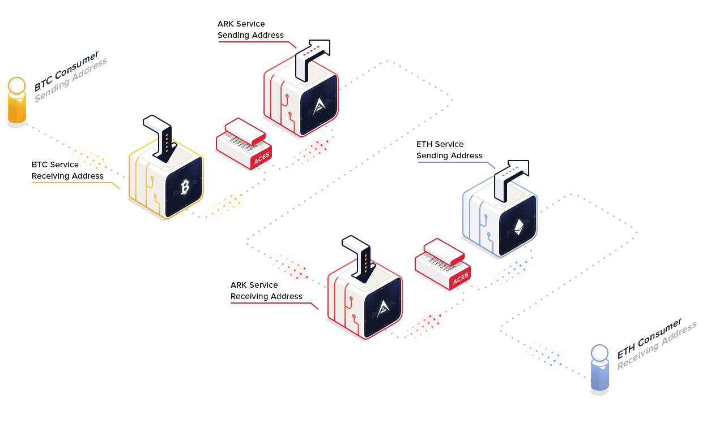

# Interoperability And PHANTOM

In order for the blockchain technology to be mass adopted we need to deliver seamless communication between different blockchains. We need universal interoperability where solutions/products need the interoperability of public networks with the privacy and power of private networks. Interoperability simply means inter- and cross-blockchain communication. However keeping that cross communication somewhat private is important, and PHANTOM aims to build that functionaility

Interoperability should be addressed at different levels. Looking at PHANTOM technology stack we are addressing this with  [PHANTOM PCES - Pces Contract Execution Services](https://phantompces.com/) for cross-chain communication with smartbridges. As for interchain communication (two different blockchains with the same technology stack should be able to "talk" with each other - i.e. enabling atomic swaps, sharing data, using the same consensus mechanism). We don't want to bloat the main network (the famous CryptoKittes example) by pushing all the stakeholders on the same level of technology - there is no blockchain to rule them all.

PHANTOM is at its core defined to address the challenge of interoperability with so called [Smartbridge](/introduction/ark/how-does-ark-smartbridge-work)  architecture approach. PHANTOM PCES is a perfect example of a solution addressing interoperability issues between different blockchains.

PCES is a community based project solving the problem of interchain transactions and communication. PCES enables the blockchain economy by allowing micro-chain projects to connect to the liquidity and functionality of the entire blockchain ecosystem. We cannot achieve this with protocol-specific interoperability, but protocol-specific interoperability is almost certainly cheaper, faster, and possibly more trustless than a protocol-agnostic interoperability. PCES focuses on protocol-agnostic interoperability because it allows us to integrate all potential future developments in the space. Protocol-agnostic interoperability combined with protocol-specific interoperability is a powerful concept that adds massive efficiencies to the entire space.

> PCES Bridge Services concept using vendor field encoded listeners

To address this we deliver options to clone our technology (see [How To Deploy Your Own PHANTOM Chain On Azure?](/cookbook/deployer/setup-with-azure)). PHANTOM Deployer enables users, local communities, and other value chains to start their own network where the most of the workload will be done, and when needed the communication with master chain will be used. By using the master chain, all the bridgechains gain the benefits, such as being already listed on exchanges, established trust and presence, all the technology in the back-end can be reused.
